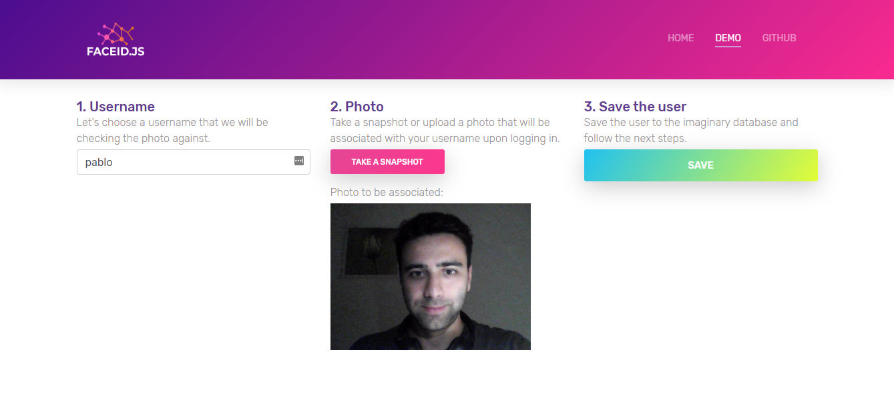

# faceID.js

[Demo](https://faceid-37c3b.firebaseapp.com/)

[Medium article](https://medium.com/@gusgadirov/bringing-face-id-authentication-to-the-web-11677cf77c2f)

The AI powered faceID.js brings your website authentication system to the next level and lets you manipulate user accounts by associating facial descriptors with usernames. The purpose of this repository and the [webapp](https://faceid-37c3b.firebaseapp.com/) (https://faceid-37c3b.firebaseapp.com/) is to demonstrate the faceID functionality by taking you through the user registration process and later logging in with the photo of your face.

# How faceID.js works
In the so called "demo" page, we save your username (so that we can refer to you by your name later), photo that you take and facial landmarks, on the fly in the browser's Session Storage. It does not necessarily has to be the Session Storage - we use it as our database, you can use a real database instead. On the next "login" page, you will try to authenticate yourself only by your photo. Remember, we have multiple users data (images, landmarks, usernames from let's say Daniel, Stephan and Amy) in the storage, so we simply compare your login photo with the ones we have in the storage. The steps for validating the face itself are the following:
1. As a first and the most important level of face validation is done by computing facial landmarks and calculating the Euclidean Distance between 2 images. The way facial landmarks are calculated is done by leveraging the power of Neural Networks, in particular - pretrained models for face recognition and lanmark detection (see model weights in _weights_ folder). We use **face-api.js**(https://github.com/justadudewhohacks/face-api.js) to tackle the first step, which in fact already comes with weights, networks (models) and distance calculation functions. 
2. Second validation level is using the **Perpetual Hash** in order to calculate the similarity between 2 images. You can read more about the algorithm [here](http://www.hackerfactor.com/blog/index.php?/archives/432-Looks-Like-It.html) (http://www.hackerfactor.com/blog/index.php?/archives/432-Looks-Like-It.html). Basically we end up with a score that lets us decide whether we have enough similarities between images. The package called [js-image-similarity](https://github.com/bitlyfied/js-image-similarity) is the one that inspired me to use the algorithm. The package itself is used in the faceID.js implementation as well.
3. The third and last validation step is done by calculating the **Structural Similarity (SSIM)** between images. More about it can be found [here](https://en.wikipedia.org/wiki/Structural_similarity) (https://en.wikipedia.org/wiki/Structural_similarity). [img-ssim](https://github.com/IonicaBizau/img-ssim) package comes with ready-to-use functions to run the algorithm on images. Practically, it serves the same purpose as the second step, we just have more robust validation now.

### Running the app locally
The procedure is rather easy. No npm packages to install, no bundlers. Just open the _index.html_ with your favorite browser.

Huge thanks to [@justadudewhohacks](https://github.com/justadudewhohacks) for bringing the Computer Vision and Deep Learning to the JavaScript world. You are a legend, Vincent! Thank you [@bitlyfied](https://github.com/bitlyfied) & [@IonicaBizau](https://github.com/IonicaBizau) four your amazing libraries! 😊
